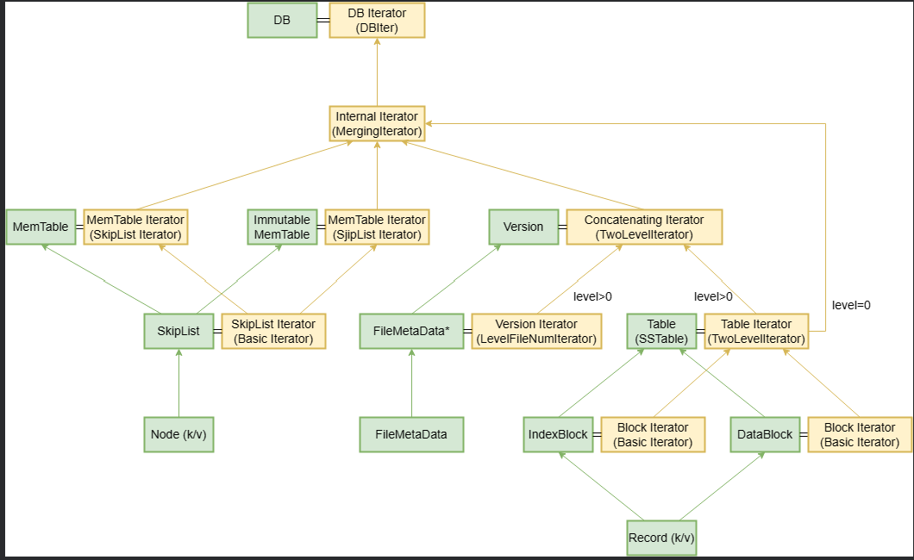

我们已经介绍了leveldb中基本所有组件的结构，接下来我们应该设计迭代器用来访问这些基本的组件。

本文将对LevelDB中迭代器Iterator的体系进行介绍，旨在梳理LevelDB中各种迭代器的功能与使用场景，对迭代器的实现介绍较少。迭代器的实现细节其实相对并不难。


## **Iterators**

LevelDB中，既有直接在集合上的基本迭代器，也有对一个迭代器进行封装来解析更复杂数据的迭代器，还有多个迭代器组成的组合迭代器，关系较为复杂。下图给出了LevelDB中数据结构与相应的迭代器的总览。其中绿的方框为数据结构，与之相连的黄色的方框为该数据结构上的迭代器。迭代器括号中指出了其本质是什么迭代器。




## **基本迭代器**
基本迭代器指直接在集合类上实现的迭代器。

| 容器      | 元素 | 迭代器 |
| ----------- | ----------- | ---------|
| SkipList |    SkipList中的Node   |     	SkipList::Iterator(const SkipList* list)    |
| MemTable  | MemTable中的key/value      |     MemTable.Iterator* NewIterator();  |
| Block  |   Block中的Entry    |   Block.Iterator* NewIterator(const Comparator* comparato   |
| FileMetaData |  每层SSTable的编号   |    Version::LevelFileNumIterator(...)    |

这几种迭代器是用来遍历基本组件的，它们的实现比较简单，主要是需要了解清楚各种组件的结构。


## **复杂的迭代器**

LevelDB通过“组合迭代器”，来讲多个迭代器组合在一起，来实现复杂的迭代器。LevelDB设计了两个组合迭代器`TwoLevelIterator`与`MergingIterator`。


##  **TwoLevelIterator**


Two Level Iterator其实就是使用两个Iterator，第一个Iterator是第二个Iterator的索引。先在第一层的Iterator做迭代，每次拿出一个元素后，根据这个元素调用回调函数，生成第二层的一个Iterator，然后第二层的Iterator迭代完成后，再在第一层取下一个元素。

对使用Two Level Iterator有两个要求: *第一层的Iterator的元素是有序排序的；* 根据第一层的Iterator生成的第二层的Iterator也是全局有序的，也就是第一层第n个元素生成的第二层Iterator的最大元素小于第一层第n + 1个元素生成的第二层Iterator的最小元素，并且第二层的每个Iterator内部也是有序的。

leveldb中有两个地方需要使用`TwoLevelIterator` 

- 第一个称之为`Table::Iterator`，它是实现单个sst文件（table）内的迭代
- 第二个是`ConcatenatingIterator`，它主要是在对某一层（大于0）内所有sst文件的迭代中用到


`TowLevelIterator` 的`Seek` 操作流程是什么

1. 首先使用index iterator的`Seek` 函数，seek到相应的index处，得到index的内容（sstable就是data_block在文件中的偏移）
2. 然后调用`block_function_` 函数，返回一个迭代器`data_iter` ，用这个迭代器真正地访问元素
3. 最后就是调用`data_iter_` 的`Seek` 函数，迭代器停留在目标位置上。


leveldb中有两个地方使用到了`TwoLevelIterrator` 

1. SSTable内部的index与data。Table Iterator作为`TwoLevelIterator`，其第一级iterator遍历SSTable中的index，第二级iterator遍历index相应的data block中的key/value。

2. level>0的SSTable，其每层SSTable可以按照key排序，每个SSTable内也按照key排序，且每层SSTable中的key没有overlap且全局有序。因此LevelDB中Version的Concaterating Iterator实际上就是一个`TwoLevelIterator`，其第一级iterator是`LevelFileNumIterator`，该iterator按照key的顺序遍历每层SSTable；其第二级iterator是Table Iterator，该iterator可以按照key的顺序遍历SSTable中的key/value。Table Iterator本身也是一个`TwoLevelIterator`


### **单个的SStable文件**

这里的`TwoLevelIterator` 比较好理解。单个sstable文件本来就有`index_block_` ，我们只需要另外传入一个`BlockReader` 函数，这个函数就是根据`index` 的内容（文件偏移）来读取特定的`data_block` ，返回一个data block的迭代器。`BlockReader` 函数比较简单，就是根据文件偏移读取一个data block。

```c
return NewTwoLevelIterator(
      rep_->index_block->NewIterator(rep_->options.comparator),
      &Table::BlockReader, const_cast<Table*>(this), options);
```


### **大于零层级的SStable文件集合**

这里有多个sstable文件，这里的`index_iter` 需要我们新建一个`LevelFileNumIterator` 的类。然后第二层级的`data_iter_` 就是一个特定的sstable文件，这个sstable文件又是一个`TwoLevelIterator` 。

```c
Iterator* Version::NewConcatenatingIterator(const ReadOptions& options,
                                            int level) const {
  return NewTwoLevelIterator(
      new LevelFileNumIterator(vset_->icmp_, &files_[level]), &GetFileIterator,
      vset_->table_cache_, options);
}
```

`LevelFileNumIterator` 把sstable文件组织成一个集合，`index_` 就是目标文件在`flist_` 中的索引。

```c
const std::vector<FileMetaData*>* const flist_;
```


当我们对ConcatenatingIterator调用`Seek` 函数的时候，首先调用的是LevelFileNumIterator的`Seek` 函数，找到所需要的sstable文件信息（LevelFileNumIterator的`value` 就是sstable文件number和文件size），然后调用`block_function_` (`GetFileIterator`) 函数，通过文件的number和size，得到一个data_iter（这里用到了缓存机制），这个data_iter 也是一个`TwoLevelIterator`，表示一个sstable文件 。

> `GetFileIterator` 函数就是返回一个sstable的`TwoLevelIterator` 


## **MergingIterator**

如果每个iterator中的key有序，但是所有iterator中的所有key全局无序，此时，需要一种能够“归并”多路有序iterator的结构。这一结构即为`MergingIterator`。

在创建`MergingIterator`时，需要传入待组合的`Iterator`数组，及用来比较每个`Iterator`中的key的`Comparator`。在通过`MerginIterator`遍历所有iterator的key时，`MergingIterator`会比较其中所有iterator的key，并按照顺序选取最小的遍历；在所有iterator的空间中seek时，`MergingIterator`会调用所有iterator的`Seek`方法，然后比较所有iterator的seek结果，按顺序选取最小的返回。

这部分的代码并不难。

```c
void MergingIterator::FindSmallest() {
  IteratorWrapper* smallest = nullptr;
  for (int i = 0; i < n_; i++) {
    IteratorWrapper* child = &children_[i];
    if (child->Valid()) {
      if (smallest == nullptr) {
        smallest = child;
      } else if (comparator_->Compare(child->key(), smallest->key()) < 0) {
        smallest = child;
      }
    }
  }
  current_ = smallest;
}

void Seek(const Slice& target) override {
    for (int i = 0; i < n_; i++) {
      children_[i].Seek(target);
    }
    FindSmallest();
    direction_ = kForward;
}


void Next() override {
    assert(Valid());

    // Ensure that all children are positioned after key().
    // If we are moving in the forward direction, it is already
    // true for all of the non-current_ children since current_ is
    // the smallest child and key() == current_->key().  Otherwise,
    // we explicitly position the non-current_ children.
    if (direction_ != kForward) {
      for (int i = 0; i < n_; i++) {
        IteratorWrapper* child = &children_[i];
        if (child != current_) {
          child->Seek(key());
          if (child->Valid() &&
              comparator_->Compare(key(), child->key()) == 0) {
            child->Next();
          }
        }
      }
      direction_ = kForward;
    }

    current_->Next();
    FindSmallest();
  }
```


LevelDB中主要有两处使用了`MergingIterator`：

其一是用来访问整个LevelDB中数据的迭代器`InternalIterator`。该迭代器组合了MemTable Iterator、Immutable MemTable Iterator、每个Level-0 SSTable的Iterator，和level>1的所有SSTable的Concatenating Iterator。

其二是执行Major Compaction时访问需要Compact的所有SSTable的迭代器`InputIterator`。对于level-0的SSTable，其直接组装了所有SSTable的Table Iterator，因为level-0中每个SSTable的key空间不保证全局有序；而对于其它level的SSTable，其通过Concatenating Iterator（即组装了LevelFileNumIterator和Table Iterator的TwoLevelIterator），该Concatenating Iterator中组装了该层需要参与Major Compaction的SSTable。


