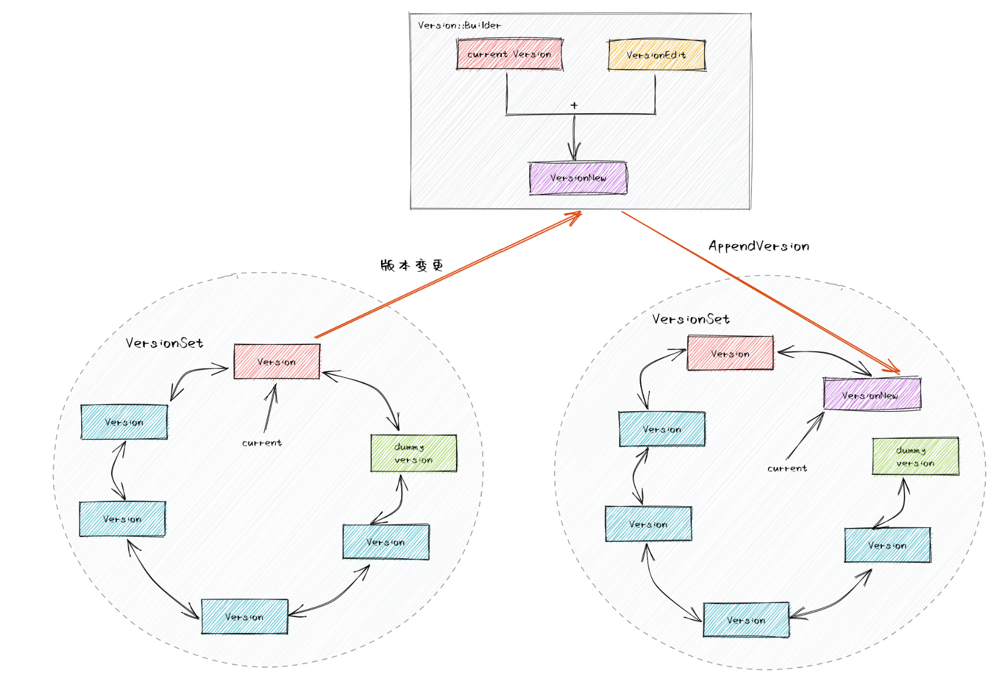

## **本讲内容**

这篇文章主要介绍leveldb中的MVCC机制，leveldb是如何进行读读并发，读写并发以及快照读的。

LevelDB的用户可以通过其提供的接口要求其保留一定时间之前的快照，在用户释放快照前，该快照创建时LevelDB中存在的数据就不会被释放。这里主要通过`Ref` 和`UnRef` 机制实现。引用计数为0的版本可以删除，同样引用计数为0的文件也可以删除，不同的版本之间可能会有重叠的文件。

想要实现MVCC，存储系统就要存储数据的多个版本。笔者将LevelDB的多版本存储设计分为了三个层次：

**从key/value的角度：** 每次变更操作的记录（Batch Writer可视为一次操作）都有不同且递增的SequenceNumber。对于一个UserKey，当存在SequenceNumber更高的的记录时，旧的记录不会被立即删除，至少要在该SequenceNumber之前的所有Snapshot都被释放后才能删除（具体删除时间与Compaction时间有关）。这是LevelDB实现Snapshot Read的基础。

**从MemTable的角度：** LevelDB中的MemTable通过引用计数来控制释放时间。在需要读取MemTable时（无论是Get操作还是Minor Compaction时），读取前会增大其引用计数，读取后减小引用计数。这样，即使MemTable已被通过Minor Compaction操作写入到Level-0文件，MemTable在被读取，它就不会被释放。

**从数据库文件的角度：** LevelDB的文件同样需要引用计数，当执行Major Compaction时，LevelDB不会立即删除已被合并的数据库文件，因为此时可能还有未完成的读取该文件的操作。


## **Version && VersionEdit && VersionSet**

首先介绍一下这几个类的关系和作用。

1. 每一个`Version` 表示一个版本，它包含这个版本所有的文件信息，还有一个`prev_` 和`next_` 指针以及引用计数
2. `VersionSet` 是当前数据库的所有版本的集合，它有一个`current_` 版本表示最新的版本。`VersionSet` 组织成一个双向链表
3. `VersionEdit` 表示版本做的变动，在创建新版本时，LevelDB首先构造`VersionEdit` ，然后通过`VersionSet::LogAndApply`方法，先将`VersionEdit` 应用到Current Version，然后将增量的VersionEdit写入Manifest文件中。




为什么需要有多个`Version` ？

某个时刻，读请求会根据version set里的current_找到最新version，并在这个version里保存的sst文件集合中寻找目标数据。此后假设发生了合并并产生了新的version，新version将更新到version set的current_字段成为新的链表头。如果此时立即删除被合并的sst文件，那么正在进行中的读请求就会出错，所以删除sst文件的动作并不是立即发生的。同时，因为读请求依据的是旧版本的version（sst文件集合），所以新合并生成的sst并不会被该读请求扫描到。

在实现上来说，读请求引用了旧版本的version，而写请求需要设置新版本的version，那么旧版本的version何时释放内存呢？这里就采用了引用计数机制，最新的version默认是1个引用计数并保存在version set的链表头部（current_），当读请求到来后会对version set的current_增加1个引用计数。此后发生合并生成新version替换current_时，先释放旧version的1个引用计数（还剩余1个由读请求持有），然后替换current_为新的version对象。

```c
Version::~Version() {
  assert(refs_ == 0);

  // Remove from linked list
  prev_->next_ = next_;
  next_->prev_ = prev_;

  // Drop references to files
  for (int level = 0; level < config::kNumLevels; level++) {
    for (size_t i = 0; i < files_[level].size(); i++) {
      FileMetaData* f = files_[level][i];
      assert(f->refs > 0);
      f->refs--;
      if (f->refs <= 0) {
        delete f;
      }
    }
  }
}
```


## **小总结**

1. 最后，我们已经介绍完了版本控制和快照，它们的关系是什么，是如何配合使用的呢，我们现在再来理一下。

在进行`Get` 进行查询时，我们总是获取当前最新版本的`version` ，在最新的`Version` 里面进行查询。如果我们要获取某个快照时K对应的V，我们需要在`opstions` 里面传入`snapshot` 参数(`uint64` )。然后根据Key和snapshot构造一个`LookupKey` ，也是在`current_` 版本里进行查询，`Current_` 版本需要引用计数加1。可能在查询的过程发生了Compaction，产生了一个新的版本`Version` ，所以历史的版本不能立马删除，只有在引用计数为0的时候才能销毁某一个`Version` 。 


2. 另外还有一个小的问题困惑了我很久，那就是假如一个Key，它的操作很多，每一个操作的sequence number都不一样，leveldb难道要记录所有的快照信息吗，这样难道会大大浪费存储空间吗？

其实这个问题的答案显而易见就藏在`DoCompactionWork` 的代码中，在`DoCompactionWork` 代码中的`Compact` 结构体中，会设置`compact->smallest_snapshot` 这个值，(用户可以调用`void ReleaseSnapshot(const Snapshot* *snapshot*)` 函数手动删除某一个快照，我们之前说过，快照也是一个双向链表组织而成的)。

```c
if (snapshots_.empty()) {
    compact->smallest_snapshot = versions_->LastSequence();
  } else {
    compact->smallest_snapshot = snapshots_.oldest()->sequence_number();
}

```

`compact->smallest_snapshot` 这样设置有什么好处呢，这样可以在Compaction的时候删除不需要的过期的数据了。

> 为什么遍历的时候要在第一次碰到某个key时把last_sequence_for_key调整成最大呢，这就是为了防止把该key的唯一的一条记录都给删除了。

```c
if (!has_current_user_key || user_comparator()->Compare(ikey.user_key, Slice(current_user_key)) !=0) {
    // First occurrence of this user key
    current_user_key.assign(ikey.user_key.data(), ikey.user_key.size());
    has_current_user_key = true;
    last_sequence_for_key = kMaxSequenceNumber;
}
if (last_sequence_for_key <= compact->smallest_snapshot) {
    // Hidden by an newer entry for same user key
    drop = true;  // (A)
}
```

如果某一个操作`Put(K1,V1)` 的sequence number为1，接下来都没有对K1的更改，后面sequence number增加到5，然后人为地删除了snapshot为1的快照，接下来某一次Compaction，因为只有一条关于K1的记录，所以在合并的过程中并不会删除这条记录，仍旧把这条记录写进新的sstable，并且sequence number也没有发生更改，也是过期的snapshot。假如我现在读取K1，仍旧会读取到这条记录，因为参数snapshot就是找到一条小于等于此snapshot号的最大的记录。