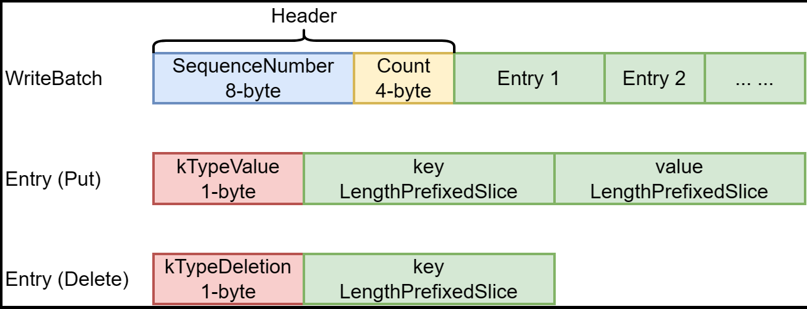

## **Put && Delete && Get**

这篇文章主要介绍一下leveldb中`Put` 和`Delete` 的接口。而`Write`接口用来批量执行`Put`或`Delete`操作，在同一批（即同一个`WriteBatch`）中的操作，其插入的entry的SequenceNumber相同。

```c
Status DB::Put(const WriteOptions& opt, const Slice& key, const Slice& value) {
  WriteBatch batch;
  batch.Put(key, value);
  return Write(opt, &batch);
}

Status DB::Delete(const WriteOptions& opt, const Slice& key) {
  WriteBatch batch;
  batch.Delete(key);
  return Write(opt, &batch);
}
```


## **WriteBatch**

`WriteBatch`是用来记录需要批处理的若干个`Put`或`Delete`操作的结构体。LevelDB会为同一个`WriteBatch`中所有操作分配相同的SequenceNumber。`WriteBatch`的结构如下图所示：



每个`WriteBatch`在内存中是一个连续的字节数组，其头12个字节是WriteBatch的Header，其中前8字节是该WriteBatch的SequenceNumber，后4字节是该WriteBatch中Entry的数量。Header后面连续存放着WriteBatch中的Entry。每个Entry的头一个字节标识了该Entry的操作类型。对于Put操作的Entry，在类型标识后以LengthPrefixedSlice编码存放着key和value；对于Delete操作的Entry，在类型标识后以LengthPrefixedSlice编码存放着待删除忽的key。

`WriteBatch` 的用法如下：

```c
leveldb::WriteBatch batch;
batch.Put(key1, value1);
batch.Delete(key1);
batch.Put(key2, value);
s = db->Write(leveldb::WriteOptions(), &batch);
```


为了优化写性能，LevelDB中提供了写合并能力，队首线程可以将队列中多个连续的写任务合并为一个写任务。

- 若队首写任务的WriteOption中sync属性为false且待合并的任务sync属性为true，则不能被合并。如下图中假设W1、W2、W3、W4、W5的sync属性为false，W6的sync属性为true，则W1~5将被合并为一个写任务，随后开始写日志文件（AddRecord）和写内存数据库（InsertIntoMemtable)。
- 写日志和内存数据库时会释放写锁，允许其他线程向写队列中添加写任务，当写任务完成时将再次加锁，并更新当前版本的操作序列号（更新前的序列号加上本次写任务的写操作数量）。
- 当前写任务完成时，写队列中可能被其他线程插入了新的任务（W9～11），已完成的写任务将陆续出队列，最后唤醒当前队首线程（W6）进行新一轮的写任务。


我们来看相关的代码：

```c
Status DBImpl::Write(const WriteOptions& options, WriteBatch* updates) {
  //创建写任务
  Writer w(&mutex_);
  w.batch = updates;
  w.sync = options.sync;
  w.done = false;

  //写任务如队列
  MutexLock l(&mutex_);
  writers_.push_back(&w);
  //队首线程拿到写锁，其他线程阻塞
  while (!w.done && &w != writers_.front()) {
    w.cv.Wait();
  }

  //排队的写任务可能在写合并时与队首任务一起完成了，无需再进行后续的写操作
  if (w.done) {
    return w.status;
  }
    
  //写前检查，内部会短暂解锁 以便其他写任务加入队列中
  Status status = MakeRoomForWrite(updates == nullptr);
  //获取操作序列号
  uint64_t last_sequence = versions_->LastSequence();
  Writer* last_writer = &w;
  if (status.ok() && updates != nullptr) { 
      //写合并
    WriteBatch* write_batch = BuildBatchGroup(&last_writer); 
    WriteBatchInternal::SetSequence(write_batch, last_sequence + 1); 
      //每个KV操作都有自己的操作序列号，序列号增加合并的KV数
    last_sequence += WriteBatchInternal::Count(write_batch);

    {
      //写日志和内存数据时写队列解锁，允许新的写任务入队列
      mutex_.Unlock();
      //写日志
      status = log_->AddRecord(WriteBatchInternal::Contents(write_batch));
      bool sync_error = false;
      if (status.ok() && options.sync) {
          //日志文件缓冲区中内容写入磁盘
        status = logfile_->Sync(); 
        if (!status.ok()) {
          sync_error = true;
        }
      }

      //写内存数据库
      if (status.ok()) {
        status = WriteBatchInternal::InsertInto(write_batch, mem_);
      }
      mutex_.Lock();
    }
    //更新操作序列号
    versions_->SetLastSequence(last_sequence);
  }

  //将已完成的写任务移出队列
  while (true) {
    Writer* ready = writers_.front();
    writers_.pop_front();
    if (ready != &w) {
      ready->status = status;
      ready->done = true;
      ready->cv.Signal(); 
    }
    if (ready == last_writer) break; //last为最后一个被合并写入的写任务
  }

  //唤醒当前队头写任务
  if (!writers_.empty()) {
    writers_.front()->cv.Signal();
  }

  return status;
}
```


## **Get操作**

首先这里为`mutex_` 进行加锁，为什么需要`MutexLock` 类？

> 这里利用了析构函数对mutex_进行解锁的，退出这个函数的作用域就会调用MutexLock析构函数，不会出现忘记解锁导致的问题。这种机制也叫作RALL(Resource Acquisition Is Initialization)。

然后从`options` 里面获取快照信息。

然后获取`mem_` 、`imm_` 和`current_` ，将依次在这里面进行查询。 

```c
Status s;
MutexLock l(&mutex_);
SequenceNumber snapshot;
if (options.snapshot != nullptr) {
    snapshot =
        static_cast<const SnapshotImpl*>(options.snapshot)->sequence_number();
} else {
    snapshot = versions_->LastSequence();
}

MemTable* mem = mem_;
MemTable* imm = imm_;
Version* current = versions_->current();
mem->Ref();
if (imm != nullptr) imm->Ref();
current->Ref();
```


然后构造`LookupKey` ，在三个层次中进行查询就可以了。

```c
bool have_stat_update = false;
  Version::GetStats stats;

  // Unlock while reading from files and memtables
  {
    mutex_.Unlock();
    // First look in the memtable, then in the immutable memtable (if any).
    LookupKey lkey(key, snapshot);
    if (mem->Get(lkey, value, &s)) {
      // Done
    } else if (imm != nullptr && imm->Get(lkey, value, &s)) {
      // Done
    } else {
      s = current->Get(options, lkey, value, &stats);
      have_stat_update = true;
    }
    mutex_.Lock();
  }

  if (have_stat_update && current->UpdateStats(stats)) {
    MaybeScheduleCompaction();
  }
  mem->Unref();
  if (imm != nullptr) imm->Unref();
  current->Unref();
  return s;
```