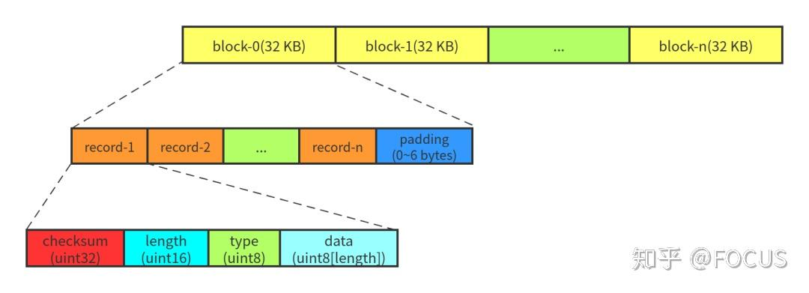

## **预写日志(WAL)背景**

LevelDB每次写key-value不会直接写到文件中，而是先暂存在Memtable中，Memtable写满后再写到文件中。如果发生故障(比如宕机)，保存在Memtable中的key-value就会全部丢失（内存是易失性存储）。所以为了保证数据的原子性和持久性，每次写key-value要预写日志，日志落盘后才会把key-value插入Memtable。日志文件和Memtable是一一对应的，Memtable落盘后，日志文件也会被删除。

LevelDB实现了一个Writer类来执行预写日志，这个Writer可以理解为一个日志文件对象，名称和DBImpl::Writer重复了，但是这两个没关系。本文提到的Writer的定义在db/log_writer.h中。


在`DBImpl::Write` 函数把内容写入到memtable之前，首先会把这些内容写入日志

```c
status = log_->AddRecord(WriteBatchInternal::Contents(write_batch));
```


## **日志的格式**

LevelDB的Log是由Record和一些为了对齐而填充的gap组成的文件。

LevelDB在读取Log文件时，为了减少I/O次数，每次读取都会读入一个32KB大小的块。因此，在写入Log文件时，LevelDB也将数据按照32KB对齐。

由于，LevelDB中记录的长度是不确定的，如果想要与32KB块对齐，为了尽可能地利用空间，那么较长的记录可能会被拆分为多个段，以能够将其放入块的剩余空间中。LevelDB定义只有1个段的记录为`FullType`，由多个段组成的记录的首位段分别为`FirstType`与`LastType`，中间段为`MiddleType`。




关于WAL机制重点在下面一讲，数据库的恢复中进行讲解，这里只简单介绍一下日志的结构。


