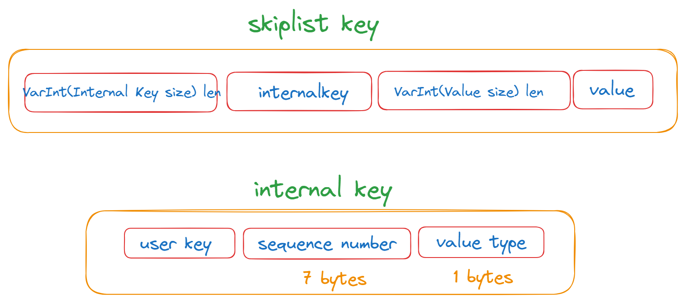

## Memtable(1)
对应文件：`memtable.h`和`memtable.cc`

每个 LevelDB 实例最多会维护两个 MemTable： mem_ 和 imm_。mem_ 可以读写，imm_ 只读。
```c
MemTable* mem_;
MemTable* imm_ GUARDED_BY(mutex_);  // Memtable being compacted
```
LevelDB 的 MemTable 的主要功能是将内部编码、内存分配（Arena）和 SkipList 封装在一起。

leveldb::MemTable 主要支持的操作有：

插入单条记录：Add。
查询单条记录：Get。
遍历（范围查询）：MemTableIterator。


### Memtable中的KV

Memtable提供了写入KV记录，删除以及读取KV记录的接口，但是事实上**Memtable并不执行真正的删除操作,**删除某个Key的Value在Memtable内是作为插入一条记录实施的，但是会打上一个Key的删除标记，真正的删除操作在后面的 Compaction过程中。
Memtable中的核心数据结构是skiplist，KV对是根据Key排序的，leveldb在插入等操作时保证key的有序性。那么skiplist是如何组织KV数据条目的呢?

1. InternalKey
InternalKey是一个复合概念，是有几个部分组合成的一个key，ParsedInternalKey就是对InternalKey分拆后的结果(本质是一个东西)
InternalKey是由User key + SequenceNumber + ValueType组合而成的
```
| User key (string) | sequence number (7 bytes) | value type (1 byte) |
```


`InternalKey` 按照 user key 从小到大，sequence number 从大到小进行排序。


2. LookupKey
   这是用户用来查询的key。

```
| Size (int32变长)| User key (string) | sequence number (7 bytes) | value type (1 byte) |
```

可以分别从LookupKey得到Internal Key，Memtable Key和User Key，如下：
```c
// Return a key suitable for lookup in a MemTable.
Slice memtable_key() const { return Slice(start_, end_ - start_); }

// Return an internal key (suitable for passing to an internal iterator)
Slice internal_key() const { return Slice(kstart_, end_ - kstart_); }

// Return the user key
Slice user_key() const { return Slice(kstart_, end_ - kstart_ - 8); }
```


这一部分可以看一下skiplist.h中的代码。