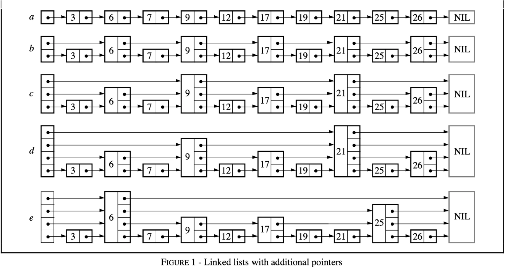

## **Memtable(2)**

这篇文章我们开始剖析`Memtable` 的代码实现和核心数据结构`SkipList` 

相较于传统的链表，跳表采取空间换时间的策略，建立多层索引，实现了查找和插入都只需要logn级别的优化。

`SkipList` 的结构如下所示：




## **SkipList的结构**

LevelDB 跳表代码上，主要涉及 C++11 中 atomic 标准库中新支持的几种 memory order，规定了一些指令重排方面的限制，仅说明下用到的三种：

1. `std::memory_order_relaxed`：不对重排做限制，只保证相关共享内存访问的原子性。
2. `std::memory_order_acquire`: 用在 load 时，保证同线程中该 load 之后的对相关内存读写语句不会被重排到 load 之前，并且其他线程中对同样内存用了 store release 都对其可见。
3. `std::memory_order_release`：用在 store 时，保证同线程中该 store 之后的对相关内存的读写语句不会被重排到 store 之前，并且该线程的所有修改对用了 load acquire 的其他线程都可见。

`skiplist` 是由一个个的`Node` 结构体构成的，每一个`Node` 都有一个`Next_` 的数组，指向不同层级索引的下一个`Node` 的位置。、

> 这里`std::atomic<Node*> next_[1]` 用到了柔性数组，就是利用malloc可以实现多层级的索引的效果。

```c
template <typename Key, class Comparator>
struct SkipList<Key, Comparator>::Node {
  explicit Node(const Key& k) : key(k) {}

  Key const key;

  // Accessors/mutators for links.  Wrapped in methods so we can
  // add the appropriate barriers as necessary.
  Node* Next(int n) {
    assert(n >= 0);
    // Use an 'acquire load' so that we observe a fully initialized
    // version of the returned Node.
    return next_[n].load(std::memory_order_acquire);
  }
  void SetNext(int n, Node* x) {
    assert(n >= 0);
    // Use a 'release store' so that anybody who reads through this
    // pointer observes a fully initialized version of the inserted node.
    next_[n].store(x, std::memory_order_release);
  }

  // No-barrier variants that can be safely used in a few locations.
  Node* NoBarrier_Next(int n) {
    assert(n >= 0);
    return next_[n].load(std::memory_order_relaxed);
  }
  void NoBarrier_SetNext(int n, Node* x) {
    assert(n >= 0);
    next_[n].store(x, std::memory_order_relaxed);
  }

 private:
  // Array of length equal to the node height.  next_[0] is lowest level link.
  std::atomic<Node*> next_[1];
};
```


### **查找**

查找是插入的基础，每个节点要先找到合适位置，才能进行插入。因此 LevelDB 抽象出了一个公用函数： `FindGreaterOrEqual` ：

```c
template <typename Key, class Comparator>
bool SkipList<Key, Comparator>::Contains(const Key& key) const {
  Node* x = FindGreaterOrEqual(key, nullptr);
  if (x != nullptr && Equal(key, x->key)) {
    return true;
  } else {
    return false;
  }
}
```

该函数的含义为：在跳表中查找不小于给 Key 的第一个值，如果没有找到，则返回 nullptr。如果参数 `prev` 不为空，在查找过程中，记下待查找节点在各层中的前驱节点。显然，如果查找操作，则指定 `prev = nullptr` 即可；若要插入数据，则需传入一个合适尺寸的 `prev` 参数。

```c
template <typename Key, class Comparator>
typename SkipList<Key, Comparator>::Node*
SkipList<Key, Comparator>::FindGreaterOrEqual(const Key& key, Node** prev) const {
  Node* x = head_;                // 从头结点开始查找
  int level = GetMaxHeight() - 1; // 从最高层开始查找
  while (true) {
    Node* next = x->Next(level);  // 该层中下一个节点
    if (KeyIsAfterNode(key, next)) {
      x = next;                   // 待查找 key 比 next 大，则在该层继续查找
    } else {
      if (prev != nullptr) prev[level] = x;

      if (level == 0) {           // 待查找 key 不大于 next，则到底返回
        return next;
      } else {                    // 待查找 key 不大于 next，且没到底，则往下查找
        level--;
      }
    }
  }
}
```


### **插入**

```c
template <typename Key, class Comparator>
void SkipList<Key, Comparator>::Insert(const Key& key) {
  // 待做(opt): 由于插入要求外部加锁，因此可以使用 NoBarrier_Next 的 FindGreaterOrEqual 以提高性能
  Node* prev[kMaxHeight]; // 长度设定简单粗暴，直接取最大值（kMaxHeight = 12）肯定没错。
  Node* x = FindGreaterOrEqual(key, prev);

  // LevelDB 跳表要求不能插入重复数据
  assert(x == nullptr || !Equal(key, x->key));

  int height = RandomHeight(); // 随机获取一个 level 值
  if (height > GetMaxHeight()) { // GetMaxHeight() 为获取跳表当前
    for (int i = GetMaxHeight(); i < height; i++) {
      prev[i] = head_;
    }
    // 此处不用为并发读加锁。因为并发读在（在另外线程中通过 FindGreaterOrEqual 中的 GetMaxHeight）
    // 读取到更新后跳表层数，但该节点尚未插入时也无妨。因为这意味着它会读到 nullptr，而在 LevelDB
    // 的 Comparator 设定中，nullptr 比所有 key 都大。因此，FindGreaterOrEqual 会继续往下找，
    // 符合预期。
    max_height_.store(height, std::memory_order_relaxed);
  }

  x = NewNode(key, height);
  for (int i = 0; i < height; i++) {
    // 此句 NoBarrier_SetNext() 版本就够用了，因为后续 prev[i]->SetNext(i, x) 语句会进行强制同步。
    // 并且为了保证并发读的正确性，一定要先设置本节点指针，再设置原条表中节点（prev）指针
    x->NoBarrier_SetNext(i, prev[i]->NoBarrier_Next(i));
    prev[i]->SetNext(i, x);
  }
}
```

