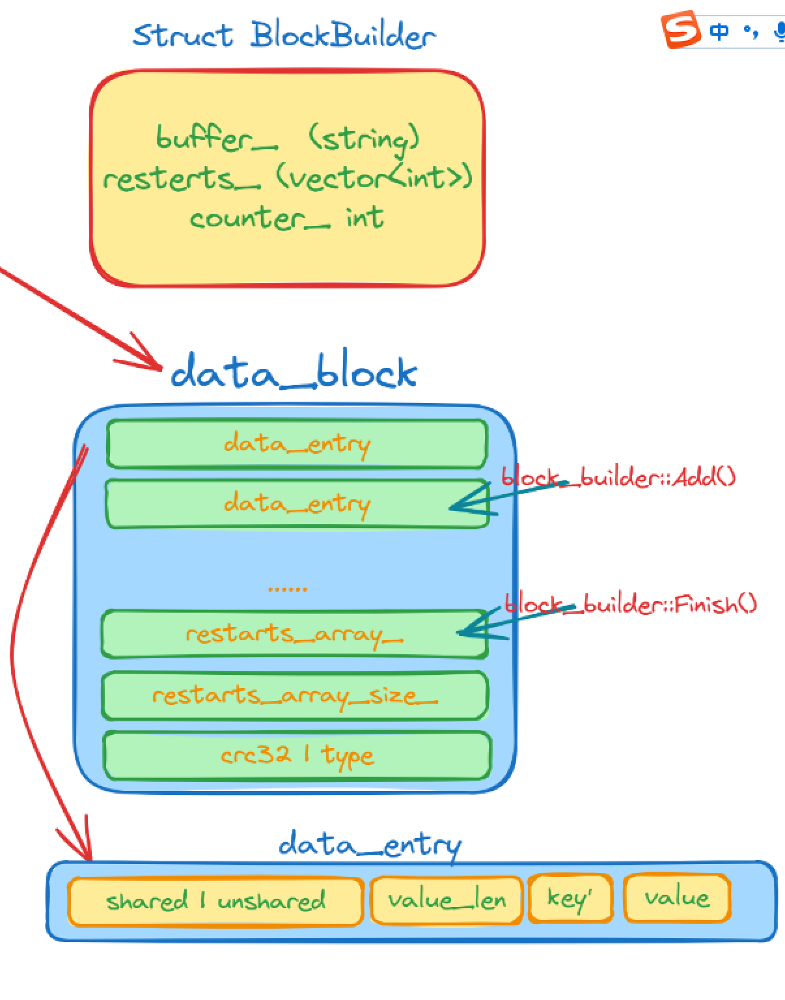

## BlockBuilder

在讲解sstable之前，我们先来看一下Block结构体的内容。

Block由一条条的data_entry(前缀压缩)，以及重启点数组，重启点数组的大小还有5字节的crc32与一个type组成。所以我们解析一个block是很容易的。首先由于最后5个字节是crc32和type，所以可以找到重启点数组大小从而定位到重启点数组的开始位置，进而每一个data_entry都可以解析出来了。

- BlockBuilder结构体成员：

```c
const Options* options_;
std::string buffer_;              // Destination buffer
std::vector<uint32_t> restarts_;  // Restart points
int counter_;                     // Number of entries emitted since restart
bool finished_;                   // Has Finish() been called?
std::string last_key_;
```





**BlockBuilder**对key的存储是前缀压缩的，对于有序的字符串来讲，这能极大的减少存储空间。但是却增加了查找的时间复杂度，为了兼顾查找效率，每隔K个key，leveldb就不使用前缀压缩，而是存储整个key，这就是**重启点**
在构建Block时，有参数Options::block_restart_interval定每隔几个key就直接存储一个重启点key。

对于一个k/v对，其在block中的存储格式为：
* 共享前缀长度 shared_bytes: varint32
* 前缀之后的字符串长度 unshared_bytes: varint32
* 值的长度 value_length: varint32
* 前缀之后的字符串 key_delta: char[unshared_bytes]
* 值 value: char[value_length]


### Block的相关接口

- Add接口

这个Add函数没有什么好解释的，就是如果`count_` 等于`block_restart_interval` ，就不需要计算前缀，否则需要计算前缀。然后就往`buffer_` 中写入即可。

```c
void BlockBuilder::Add(const Slice& key, const Slice& value) {
  Slice last_key_piece(last_key_);
  assert(!finished_);
  assert(counter_ <= options_->block_restart_interval);
  assert(buffer_.empty()  // No values yet?
         || options_->comparator->Compare(key, last_key_piece) > 0);
  size_t shared = 0;
  if (counter_ < options_->block_restart_interval) {
    // See how much sharing to do with previous string
    const size_t min_length = std::min(last_key_piece.size(), key.size());
    while ((shared < min_length) && (last_key_piece[shared] == key[shared])) {
      shared++;
    }
  } else {
    // Restart compression
    restarts_.push_back(buffer_.size());
    counter_ = 0;
  }
  const size_t non_shared = key.size() - shared;

  // Add "<shared><non_shared><value_size>" to buffer_
  PutVarint32(&buffer_, shared);
  PutVarint32(&buffer_, non_shared);
  PutVarint32(&buffer_, value.size());

  // Add string delta to buffer_ followed by value
  buffer_.append(key.data() + shared, non_shared);
  buffer_.append(value.data(), value.size());

  // Update state
  last_key_.resize(shared);
  last_key_.append(key.data() + shared, non_shared);
  assert(Slice(last_key_) == key);
  counter_++;
}
```


- Finish接口

当data_entry条目已经写完了时，就需要往`buffer_` 里面写入重启点数组和重启点数组的大小

```c
Slice BlockBuilder::Finish() {
  // Append restart array
  for (size_t i = 0; i < restarts_.size(); i++) {
    PutFixed32(&buffer_, restarts_[i]);
  }
  PutFixed32(&buffer_, restarts_.size());
  finished_ = true;
  return Slice(buffer_);
}
```


