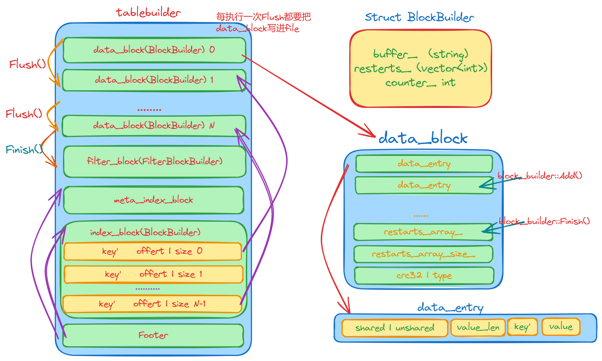

## sstable

首先我们看一下sstable的结构图
1. 文件中的k/v对是有序存储的，并且被划分到连续排列的Data Block里面，这些Data Block从文件头开始顺序存储，Data Block的存储格式代码在block_builder.cc中；

2. 紧跟在Data Block之后的是Meta Block，其格式代码也在block_builder.cc中；Meta Block存储的是Filter信息，比如Bloom过滤器，用于快速定位key是否在data block中。

3. MetaIndex Block是对Meta Block的索引，它只有一条记录，key是meta index的名字（也就是Filter的名字），value为指向meta index的BlockHandle；BlockHandle是一个结构体，成员offset_是Block在文件中的偏移，成员size_是block的大小；

4. Index block是对Data Block的索引，对于其中的每个记录，其key >=Data Block最后一条记录的key，同时<其后Data Block的第一条记录的key；value是指向data index的BlockHandle；



sstbale结构体主要的一些成员
```c
Options options;
Options index_block_options;
WritableFile* file;                   // 要写入的文件
uint64_t offset;                      // 文件已写入的大小  
Status status;            
BlockBuilder data_block;              // data_block缓冲，满后写入文件再置空          
BlockBuilder index_block;             // index缓冲，最后才写入文件
std::string last_key;                 // 上一次插入的 key , 用来前缀压缩
int64_t num_entries;                 
bool closed;  // Either Finish() or Abandon() has been called.
FilterBlockBuilder* filter_block;    
bool pending_index_entry;
BlockHandle pending_handle;            // Handle to add to index block
std::string compressed_output;
```


sstable构建过程：

1. 首先往data_block中不断`Add`插入数据，更新index_block和filter_block
2. 如果data_block地大小超过了指定大小，就要调用`Flush`函数，将新的data_block写入文件中，然后再调用data_block的`reset`函数，把它置为空。
3. 直到table_builder调用了`Finish` 函数，整个过程才结束。`Finish` 函数首先调用`Flush` 把data_block写入文件，至此，data_block已经全部写入文件中了。然后再把filter_block写入文件，再写meta_index_block,再写index_block,最后为sstable的末尾添加一个footer。


## sstable接口
### Add

1. 如果`pending_index_entry` 为 true, 也就是data_block为空的时候，首先找到一个长度最短的字符串，使得这个字符串的大小大于等于`last_key` 小于`key` ，并把这个字符串赋值给`last_key` 。然后`r->index_block.Add(r->last_key, Slice(handle_encoding))` 为index_block插入一个索引。这就表示了key大于等于`last_key` 的第一个data_entry的位置在当前文件的`offset_` 处。

> 这里的`BlockHanle pending_hanle` 就是表示Block的信息的一个结构体，有`offset_` 和`size_` 两个成员，`EncodeTo` 函数就是把这两个成员进行encode,把这个字符串当做index_block的Value部分，这样就可以快速定位到文件的指定位置了。
> 初始的时候，pending_index_entry置为false也就不难理解了

2. 接下来就是往data_block中写入KV，如果Block超过指定大小了，就要进行`Flush` 操作

```c
void TableBuilder::Add(const Slice& key, const Slice& value) {
  Rep* r = rep_;
  assert(!r->closed);
  if (!ok()) return;
  if (r->num_entries > 0) {
    assert(r->options.comparator->Compare(key, Slice(r->last_key)) > 0);
  }

  if (r->pending_index_entry) {
    assert(r->data_block.empty());
    // 这里会把结果赋值给 r->last_key
    r->options.comparator->FindShortestSeparator(&r->last_key, key);
    std::string handle_encoding;
    r->pending_handle.EncodeTo(&handle_encoding);
    r->index_block.Add(r->last_key, Slice(handle_encoding));
    r->pending_index_entry = false;
  }

  if (r->filter_block != nullptr) {
    r->filter_block->AddKey(key);
  }

  r->last_key.assign(key.data(), key.size());
  r->num_entries++;
  r->data_block.Add(key, value);

  const size_t estimated_block_size = r->data_block.CurrentSizeEstimate();
  if (estimated_block_size >= r->options.block_size) {
    Flush();
  }
}
```


### Flush
`Flush`函数就是把data_block写入文件中，把`pending_index_entry`置为true.

```c
void TableBuilder::Flush() {
  Rep* r = rep_;
  assert(!r->closed);
  if (!ok()) return;
  if (r->data_block.empty()) return;
  assert(!r->pending_index_entry);
  WriteBlock(&r->data_block, &r->pending_handle);
  if (ok()) {
    r->pending_index_entry = true;
    r->status = r->file->Flush();
  }
  if (r->filter_block != nullptr) {
    r->filter_block->StartBlock(r->offset);
  }
}
```


### WriteBlock 和 WriteRawBlock

`WriteBlock` 这个函数需要进行一些压缩处理的技巧，最后会调用`WriteRawBlock` 函数

`WriteRawBlock` 这个函数就是把内容写入文件中，再在末尾添加一个crc32和一个type共5个字节的内容


### Finish

`Finish` 函数表示SST的数据部分(data_block)已经全部`Add` 了，现在需要把filter_block,index，meta_index_block，index_block，footer写入到文件中了。

```c
Status TableBuilder::Finish() {
  Rep* r = rep_;
  Flush();
  assert(!r->closed);
  r->closed = true;

  BlockHandle filter_block_handle, metaindex_block_handle, index_block_handle;

  // Write filter block
  if (ok() && r->filter_block != nullptr) {
    WriteRawBlock(r->filter_block->Finish(), kNoCompression,
                  &filter_block_handle);
  }

  // Write metaindex block
  if (ok()) {
    BlockBuilder meta_index_block(&r->options);
    if (r->filter_block != nullptr) {
      // Add mapping from "filter.Name" to location of filter data
      std::string key = "filter.";
      key.append(r->options.filter_policy->Name());
      std::string handle_encoding;
      filter_block_handle.EncodeTo(&handle_encoding);
      meta_index_block.Add(key, handle_encoding);
    }

    // TODO(postrelease): Add stats and other meta blocks
    WriteBlock(&meta_index_block, &metaindex_block_handle);
  }

  // Write index block
  if (ok()) {
    if (r->pending_index_entry) {
      r->options.comparator->FindShortSuccessor(&r->last_key);
      std::string handle_encoding;
      r->pending_handle.EncodeTo(&handle_encoding);
      r->index_block.Add(r->last_key, Slice(handle_encoding));
      r->pending_index_entry = false;
    }
    WriteBlock(&r->index_block, &index_block_handle);
  }

  // Write footer
  if (ok()) {
    Footer footer;
    footer.set_metaindex_handle(metaindex_block_handle);
    footer.set_index_handle(index_block_handle);
    std::string footer_encoding;
    footer.EncodeTo(&footer_encoding);
    r->status = r->file->Append(footer_encoding);
    if (r->status.ok()) {
      r->offset += footer_encoding.size();
    }
  }
  return r->status;
}
```

`Footer` 中有一些什么信息？

> Footer中记录了metaindex_block和index_block的位置，以及一个魔数magic number。

