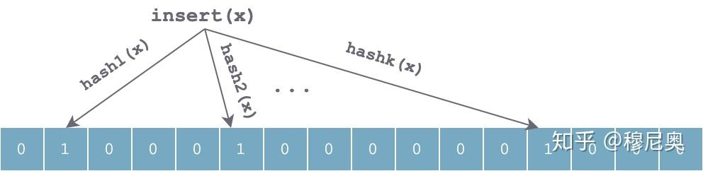
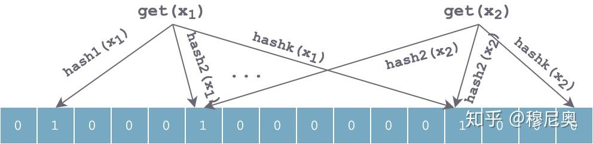

## 为什么需要FilterBlock
Filter block为SST中一个区块，filter block由多个filter组成，每个data block对应一个filter（但是一个filter可能对应多个data block）。LevelDB在进入data block中查找前会先检查filter，如果filter判断key不在，那么key一定不在这个block中，就不用进入data block查找了，filter判断key可能存在才会进入data block查找。

Filter block由FilterBlockBuilder负责构建，下面我们先看一下FilterBlockBuilder的结构和成员函数。最后举个例子详细解释创建filter的完整过程，以方便理解。


## **Bloom Filter**

Bloom Filter 底层使用一个位数组（bit array），初始，所表示集合为空时，所有位都为 0：


当往集合中插入一个元素 x 时，利用 k 个**独立**的哈希函数分别对 x 进行散列，然后将 k 个散列值按数组长度取余后分别将数组中对应位置置为 1：



查找过程和插入过程类似，也是利用同样的 k 个哈希函数对待查找元素按顺序进行哈希，得到 k 个位置。如果位数组中 k 个位置上的位均为 1，则该元素**有可能**存在；否则，若任意一位置上值为 0，则该值**一定**不存在。对于下图来说，x1 有可能存在，x2 一定不存在。



当持续插入一些元素后，数组中会有大量位置被置 1，可以想象，肯定会有一些位置冲突，造成误判。使用 k 个独立哈希函数可以部分解决这个问题。但如果对于某个值 y，k 个 hash(y) 计算出来的位置，都恰好被其他时候插入的几个元素值设置为 1，则会误判 y 在集合中。


## **参数取舍**

从上面对 Bloom Filter 可以粗略的感受到，其误判率应该和以下参数有关：

1. 哈希函数的个数 k
2. 底层位数组的长度 m
3. 数据集大小 n

这几个参数与误判率的关系的推导这里不详细展开，可以参考[维基百科](https://link.zhihu.com/?target=https%3A//en.wikipedia.org/wiki/Bloom_filter)，或者这篇 [CSDN 文章](https://link.zhihu.com/?target=https%3A//blog.csdn.net/jiaomeng/article/details/1495500)。这里直接给出结论：

当 `k = ln2 * (m/n)` 时，Bloom Filter 获取最优的准确率。m/n 即 bits per key（集合中每个 key 平均分到的 bit 数）。


## **leveldb中的实现**

为了减小读放大，尤其是对磁盘访问的读放大，LevelDB 抽象出了一个 `FilterPolicy` 接口，用以在查找 key 时快速筛掉不符合条件的 SStable，这些 Filter 信息会和数据在 SSTable 文件中一起存储，并且在需要时加载到内存，这要求 Filter 占空间不能太大。

```c
class LEVELDB_EXPORT FilterPolicy {
 public:
  virtual ~FilterPolicy();

  // 过滤策略的名字，用来唯一标识该 Filter 持久化、载入内存时的编码方法。
  virtual const char* Name() const = 0;

  // 给长度为 n 的 keys 集合（可能有重复）创建一个过滤策略，并将策略序列化为 string ，追加到 dst 最后。
  virtual void CreateFilter(const Slice* keys, int n, std::string* dst) const = 0;

  // “过滤” 函数。若调用 CreateFilter 时传入的集合为 keys，则如果 key 在 keys 中，则必须返回 true。
  // 若 key 不在 keys 中，可以返回 true，也可以返回 false，但最好大概率返回 false。
  virtual bool KeyMayMatch(const Slice& key, const Slice& filter) const = 0;
};
```

抽象出该接口可以让用户根据自己需求实现一些其他的过滤策略。自然的，LevelDB 提供了实现了该接口的一个内置的过滤策略：`BloomFilterPolicy`：

```c
class BloomFilterPolicy : public FilterPolicy {
 public:
  explicit BloomFilterPolicy(int bits_per_key) : bits_per_key_(bits_per_key) {
    // 根据上面提到的结论：k = ln2 * (m/n)，获取哈希函数的个数 k。
    // 这里对 k 进行了向下取整、限制最大值，增加了一点误判率，但是也降低了过滤成本。
    k_ = static_cast<size_t>(bits_per_key * 0.69);  // 0.69 =~ ln(2)
    if (k_ < 1) k_ = 1;
    if (k_ > 30) k_ = 30;
  }

  const char* Name() const override { return "leveldb.BuiltinBloomFilter2"; }

  void CreateFilter(const Slice* keys, int n, std::string* dst) const override {
    // 计算 bloom filter 的 bit 数组长度 n，会除以 8 向上取整，因为 bit 数组最后会用 char 数组表示
    size_t bits = n * bits_per_key_;
    if (bits < 64) bits = 64; // 如果数组太短，会有很高的误判率，因此这里增加了一个最小长度限定。
    size_t bytes = (bits + 7) / 8;
    bits = bytes * 8;

    const size_t init_size = dst->size();
    dst->resize(init_size + bytes, 0);
    dst->push_back(static_cast<char>(k_));  // 记下哈希函数的个数
    char* array = &(*dst)[init_size];
    for (int i = 0; i < n; i++) {
      // 使用 double-hashing 方法，仅使用一个 hash 函数来生成 k 个 hash 值，近似等价于使用 k 个哈希函数的效果
      // 详细分析可以参考：https://www.eecs.harvard.edu/~michaelm/postscripts/rsa2008.pdf
      uint32_t h = BloomHash(keys[i]);
      const uint32_t delta = (h >> 17) | (h << 15);  // 循环右移 17 bits 作为步长
      for (size_t j = 0; j < k_; j++) {
        const uint32_t bitpos = h % bits;
        array[bitpos / 8] |= (1 << (bitpos % 8));
        h += delta;
      }
    }
  }

  bool KeyMayMatch(const Slice& key, const Slice& bloom_filter) const override {
    const size_t len = bloom_filter.size();
    if (len < 2) return false;

    const char* array = bloom_filter.data();
    const size_t bits = (len - 1) * 8; // -1 是去掉 k 所占空间

    // 取出创建 Filter 时保存的哈希函数个数 k
    const size_t k = array[len - 1];
    if (k > 30) {
      // 超过我们设定 k 个数，直接返回 true，不滤掉该 SSTable.
      return true;
    }

    uint32_t h = BloomHash(key);
    const uint32_t delta = (h >> 17) | (h << 15);  // 循环右移 17 bits 作为步长
    for (size_t j = 0; j < k; j++) {
      const uint32_t bitpos = h % bits;
      if ((array[bitpos / 8] & (1 << (bitpos % 8))) == 0) return false;
      h += delta;
    }
    return true;
  }

 private:
  size_t bits_per_key_;
  size_t k_;
};
}
```

根据上述源代码，LevelDB 在实现时，有以下几个点需要注意：

1. 之前提到的 bit 数组在 C++ 语言中，LevelDB 使用 char 数组来表示。因此计算 bit 数组长度时需要对齐到 8 的倍数，计算下标时需要进行适当转换。
2. LevelDB 实现时并未真正使用 k 个哈希函数，而是用了 [double-hashing](https://link.zhihu.com/?target=https%3A//www.eecs.harvard.edu/~michaelm/postscripts/rsa2008.pdf) 方法进行了一个优化，号称可以达到相似的正确率。