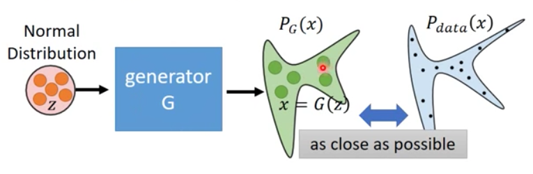
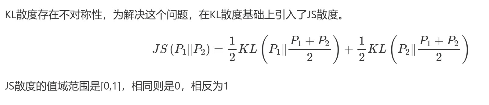
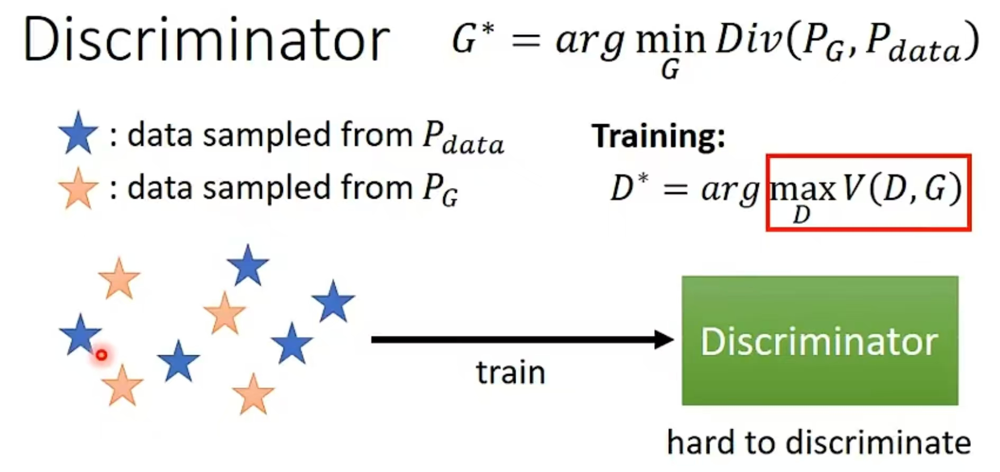
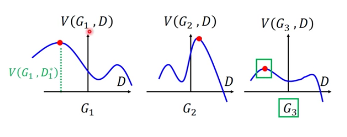
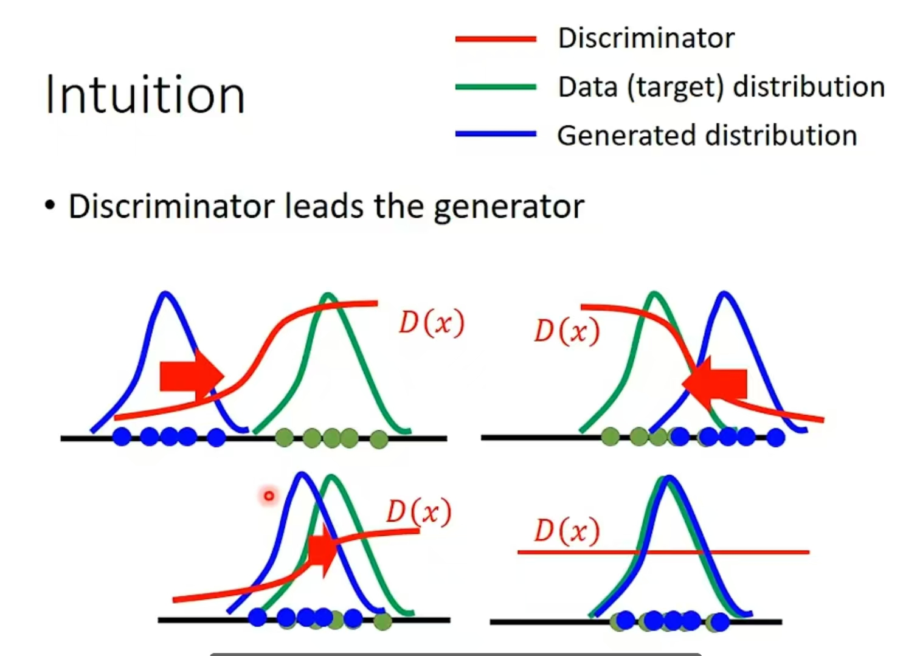

在看GAN论文的时候，有一些公式对我完全理解这篇论文造成了很大的困难，在这里想写一些对公式的理解与思考，方便以后复习的时候能尽快地抓住key idea。

## GAN的主要思想

在GAN中，潜在空间（latent space）通常使用一个简单的分布，比如多维高斯分布或均匀分布。生成器（G）接收一个从这个潜在空间中随机采样的向量 z，即 $$z∼N(0,I)$$，并将其通过神经网络映射到生成的数据空间中。随着对抗训练的进行，生成器不断优化其参数，逐渐学会将简单的高斯分布（潜在空间中的采样）通过非线性变换映射到更复杂的分布，即真实数据的分布。

## 从最大似然估计讲起

在没有GAN之前，这是用最大似然估计来做的。

最大似然估计的理念是，假如说我们的数据集的分布是$$P_{data} (x)$$，我们定义一个分布$$P_{G}(x;\theta)$$ ,我们想要找到一组参数  $$\theta$$ ,使得$$P_{G}(x;\theta)$$  越接近$$P_{data} (x)$$ 越好。

具体做法：

1. 从$$P_{data}(x)$$中sample出$\{x^1, x^2, x^3,..,x^m\}$

2. 对每一个sample出来的x， 我们都可以计算它的likelihood，也就是给定一组参数$\theta$ ,我们就能够知道$P_G (x;\theta)$长什么样，然后我们就可以计算出在这个分布里面sample出某一个x的几率。

3. 我们把在某个分布可以产生 xi 的likelihood乘起来，可以得到总的likelihood： $L=\Pi^m_{i=1}P_G(x^i;\theta)$ , 我们要找到一组$\theta^*$ , 可以最大化$L$

   

## 另外一种解释,其实最大似然估计等同于最小化KL散度

前面我们已经提到了，我们要找到一组$\theta^*$ , 可以最大化$L=\Pi^m_{i=1}P_G(x^i;\theta)$，也就是：

$$\theta^*=argmax_{\theta}\Pi_{i=1}^{m}P_G(x_i;\theta) $$

取$log$后：

$$\theta^*=argmax_{\theta}\Pi_{i=1}^{m}P_G(x_i;\theta) =argmax_{\theta}log\Pi_{i=1}^{m}P_G(x_i;\theta) \\ = argmax_{\theta}\sum_{i=1}^{m}logP_G(x_i;\theta)$$

当我们把m取全集的时候，可以看成一个积分形式：

$$\theta^* = argmax_{\theta}\int_{x} P_{data}(x)log P_G(x;\theta) \, dx$$

我们可以在后面加一个无关项，变为如下：

$$\theta^* = argmax_{\theta}\int_{x} P_{data}(x)log P_G(x;\theta) \, dx - \int_{x} P_{data}(x)log P_{data}(x;\theta) \, dx$$

因为加上这一项后，会发现这就是一个$P_{data}, P_G$的KL散度，KL散度用来衡量两个分布的差异。所以根据上述推导，我们想要找到$\theta$来使得maximum likelihood，也就等价于最小化$P_{data}, P_G$的KL散度。

$$\theta^* =argmin_{\theta} KL(P_{data}||P_G)$$

**最大似然的局限性**

假设我们的$P_G$是一个比高斯分布复杂得多的东西(比如说一个nerual network)，那么我们会遇到问题也就是我们算不出这个likelihood，也就是算不出$logP_G(x;\theta)$这一项。

前面我们说了，虽然input是一个normal distribution，但是通过G以后，把这个z通过一个非常复杂的转换变成x。我们要使得根据这个G定义出来的分布$P_G$，它跟我们的data的分布$P_{data}$越接近越好。也就是：

$$G^* = arg min_G Div(P_G, P_{data})$$

找到关于G的一组参数，使得$P_G ,P_{data}$这两个分布的散度最小。这里可能是某一种divergence。

那问题又来了，如何计算这个divergence呢？$P_G ,P_{data}$这两个分布我们都不知道呀，我们只知道的是噪声z的分布。

讲到了散度，这里顺便讲一下什么是JS散度：

## Discriminator

我们可以从这两个分布中sample出一些样本出来。对于$P_{data}$来说，我们从给定的数据集中sample出一些样本，对于$P_G$ 来说，我们随机sample一些向量，扔到Generator里面，然后generator会输出一些图片。现在我们有了这些sample， 透过discriminator，我们可以计算$P_{G}$和$P_{data}$的divergence，这就是GAN神奇的地方。

我们来看训练D时需要主义的下面这两个公式：

$$V(G,D) = E_{x \sim P_{data}}[logD(x)] + E_{x \sim P_G}[log(1-D(x))]$$

$$D^* = arg max_D V(D, G)$$

在训练D的时候，我们会固定住这个G，想办法去maximize $V(G,D)$这一项。这个目标函数的意思是，假设x是从 $P_{data}$ 里面sample出来的，那么希望$logD(x)$越大越好。如果是从$P_G$里面sample出来的，就希望它的值越小越好。

当我们解这个最优化的问题(调整D最大化$V(G,D)$)的时候，最后会得到一个最小的loss(或者是最大的$V(G,D)$)，这个$V(G,D)$其实和JS divergence密切相关。接下来给一个比较直观地解释：

假设这两个分布靠的很近，这个D就很难区别$P_G$跟$P_{data}$，也就是说$V(G,D)$达不到一个很大的值，也就说明散度比较小，JS divergence就比较小，也就是两个分布很接近。反之亦然。

下面给一个简单的数学推导：

$$\min_G\max_DV(D,G)=\mathbb{E}_{\boldsymbol{x}\sim p_{\boldsymbol{data}}(\boldsymbol{x})}[\log D(\boldsymbol{x})]+\mathbb{E}_{\boldsymbol{z}\sim p_{\boldsymbol{z}}(\boldsymbol{z})}[\log(1-D(G(\boldsymbol{z})))].$$

$$\begin{gathered}
V(G,D) \begin{aligned}=\int_{\boldsymbol{x}}p_{\mathbf{data}}(\boldsymbol{x})\log(D(\boldsymbol{x}))dx+\int_{\boldsymbol{z}}p_{\boldsymbol{z}}(\boldsymbol{z})\log(1-D(g(\boldsymbol{z})))dz\end{aligned} \\
=\int_{\boldsymbol{x}}p_{\mathbf{data}}(\boldsymbol{x})\log(D(\boldsymbol{x}))+p_g(\boldsymbol{x})\log(1-D(\boldsymbol{x}))dx 
\end{gathered}$$

因为我们固定住了G，要找到D使得$V(G,D)$最小，所以我们可以把$D(x)$看成自变量，将$P_{data}$用a表示，$P_{G}$用b表示，那么上式可写为：

$$f(D) = alog(D) + blog(1-D) \\$$

我们对其进行求导，有：

$$\frac{df(D)}{dD} = a *\frac{1}{D} + b*\frac{1}{1-D}*(-1) \\$$

得到极大值点：

$$D^*= \frac{a}{a+b} \\$$

即：

$$D^*= \frac{P_{data}(x)}{P_{data}(x)+P_G(x)} \\$$

把它带入$V(G,D^*)$里面，就可以化为JS divergence的形式：

$\begin{align*} max_DV(G,D) &= V(G,D*) \\  &= E_{x\sim P_{data}}[log\frac{P_{data}(x)}{P_{data}(x)+P_G(x)}]  + E_{x\sim P_{G}}[log\frac{P_G(x)}{P_{data}(x)+P_G(x)}]  \\ &= \int_{x}P_{data}(x)log\frac{P_{data}(x)}{P_{data}(x)+P_G(x)}dx + \int_{x}P_G(x)log\frac{P_G(x)}{P_{data}(x)+P_G(x)}dx \\ &= -2log2 + \int_{x}P_{data}(x)log\frac{P_{data}(x)}{(P_{data}(x)+P_G(x))/2}dx + \int_{x}P_G(x)log\frac{P_G(x)}{(P_{data}(x)+P_G(x))/2}dx \\ &=-2log2 + KL(P_{data}||\frac{P_{data}+P_G}{2}) + KL(P_{G}||\frac{P_{data+P_G}}{2})\\ &=-2log2 + 2JSD(P_{data}||P_G) \end{align*} \\$

通过这一系列的化简，我们可以知道，最大化$V(G,D*)$，其实就是求解分布$P_{data},P_G$的JS divergence。所以当去训练一个distriminator，就是通过$P_{data}, P_G$sample出来的样本去求这两个分布的差异。

当我们在训练一个D的时候，我们想要做的事情就是评估$P_{data}$跟$P_G$这两个分布sample出来的data它们之间的JS divergence(当我们的目标函数是上面的$V(D,G)$的时候，当这个目标函数写的不一样，我们就可以评估其他各种的divergence)。

再从头理一遍：

我们设计GAN的目标是找到一个$G^*$，去最小化$P_{G}, P_{data}$ 的差异，也就是：

$$G^* = argmin_GDiv(P_G, P_{data}) $$

但这个divergence我们没有办法直接计算(我们并不知道$P_G, P_{data}$的具体公式)，为此我们就引入了D网络来计算两个分布间的差异，D就是尽可能判别真币和假币：

$D^*=argmax_DV(D,G) $

这个$V(G,D)$我们是可以通过sample进行计算的，那我们的优化目标就变为了：

$G^* = argmin_Gmax_DV(G,D) \\$

再画图直观感受一下：

我们假设我们有三个G网络，我们已经把G网络固定住了，我们要找到最优的G使得$P_{G}, P_{data}$的分布尽可能相近。而对于D，我们要找到$V(G,D)$在G已经被固定的情况下，D取什么参数时，它的值最大。分别用三个红点表示。然后我们想要最小化这个$V(G,D)$，我们可以看到$G_3$网络是最优秀的。

## GAN是如何训练的

在每一次迭代中：

**首先训练的是Discriminator，这是求解$max_D V(G,D)$的过程，也就是JS Div**

1. 从数据集$P_{data}(x)$中sample出m个样本$\{x^1, x^2...x^m\}$
2. 从一个分布(可以是高斯，均值..., 这个不重要)中sample出m个向量$\{z^1,z^2,..,z^m\}$

3. 将第2步中的z作为输入，获得m个生成的数据$\{\check{x}^1,\check{x}^2...\check{x}^m\}, \check{x}^i= G(z^i)$
4. 更新discriminator的参数$\theta_d$来最大化$\check{V}$

在实际训练中，$V(G,D)$是如何计算的呢？我们并不是求上面那个期望的积分。

$$\check{V} = \frac{1}{m}\sum_{i=1}^mlogD(x^i ) + \frac{1}{m}\sum_{i=1}^mlog(1-D(\check{x}^i)))$$

这个式子也就等同于在训练一个binary classifier，然后就是更新D，使得这个$\check{V}$最大。

$\theta_d \leftarrow\theta_d + \eta \nabla\check{V}(\theta_d)$

这里可能需要训练比较多次，才能把这个D训练的很好，找到$\check{V}$的最大值。

**训练Generator，为了减少JS Div，也就是求解$min_Gmax_D V(G,D)$的过程**

1. 从一个分布中sample出m个向量$\{z^1,z^2,..,z^m\}$，这些sample不需要和步骤2中的保持一致。
2. 更新generator的参数$\theta_g$来最小化:

$\check{V} = \frac{1}{m}\sum_{i=1}^mlog(1- (D(G(z^i ))) $   (因为第一项和G是没有关系的)

$\theta_g \leftarrow\theta_g - \eta \nabla\check{V}(\theta_g)$

最后回顾这个过程，首先训练D，D会给伪造的数据一个低分，给真实的分布一个高分，这个D的objective value就是这两堆data的JS Divergence(或某种其他的散度)。然后训练G，为了使它产生出来的东西经过D后得到的分数尽可能大，所以训练到新的分布(并不是z的分布)就会往右移动。以此迭代。

