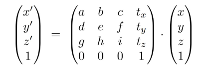

# Transformation变换(1)
## 1.基础变换
* 引入齐次坐标，对于二维平面：

点 (x, y) ，其齐次坐标为：(x, y ,1) ；   向量(x, y)，其齐次坐标为：(x, y, 0)
可以保证加减性质不变：

想一想：点 + 点表示的是上面：
>表示的是两个点连线的中点、
>

### 1.1 缩放

### 1.2旋转

### 1.3平移

### 1.4仿射变换
仿射变换 = 线性变换 + 平移变换

### 1.5复合变换
多个简单的变换矩阵可以组合成一个矩阵（相乘即可，注意顺序）
比如要将某个点绕着一个非原点的点（a, b）旋转a度，可以进行如下操作：
思路：
1. 我们先把点(a,b)看成原点，这就需要先做平移变换，将点平移(-a,-b)

2. 然后绕着原点旋转a度

3. 然后把点平移(a,b)

### 1.6逆变换
观察旋转矩阵,逆时针旋转 a 角度
$$
A = 
\begin{bmatrix}
\cos(\alpha) & -\sin(\alpha) \\
\sin(\alpha) & \cos(\alpha)  \\
\end{bmatrix}
$$
若要旋转 -a 角度，则其变换矩阵为：
$$
B = 
\begin{bmatrix}
\cos(\alpha) & \sin(\alpha) \\
-\sin(\alpha) & \cos(\alpha)  \\
\end{bmatrix}
$$
显然可以看出:
$$
A * B = E
$$
转置矩阵与逆矩阵相等的矩阵称为**正交矩阵**。 且所有的**旋转矩阵都是正交矩阵**

## 2.3D变换
3维空间同样适用二维的齐次坐标规则
3维的仿射变换：

### 2.1缩放

### 2.2平移

### 2.3旋转
#### 2.3.1绕某一个轴旋转

* 注意：这里的绕y轴旋转公式与x和z轴有所不同。
* xyz坐标系, x叉乘y得z, y叉乘z得x，y等于z叉乘x。xyz轴的关系：z-xy, x-yz, y-zx

### 2.3.2任意旋转
任意角度的旋转都可以转换成绕x、y、z轴的旋转的组合
Rodrigues 旋转公式：

​                      
其是3阶单位矩阵，矩阵 其实就是向量的叉积矩阵（被该矩阵作用得到的结果 等同于 与n向量叉积的结果）