## 视图变换（Viewing Transformation）
视图变换需要干的事：将虚拟世界中以（x, y, z) 为坐标的物体变换到 以一个个像素位置(x, y) 来表示的屏幕坐标系之中(2维)。整个过程分为如下几个步骤：
* 模型变换（Model transformation） 摆放模型
* 视图变换（Viewing transformation） 摆放相机
* 投影变换（Projection transformation） 将相机的视图投影到照片上

模型变换我们已经讲过了，就是Transformation(1)的内容，用于空间中模型的变换。
想要在二维的屏幕上看到图像还需要相机获取视图，这部分涉及到的变换，称为视图变换

- 首先是相机的定义：
* position：$\vec{e}$ (相机所处的三维位置)
* gaze direction（look-at direction）: $\vec{g}$
* up direction: $\vec{t}$

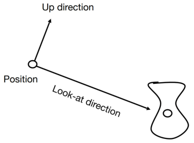

我们约定，**相机的位置处于原点，$\vec{g}$看向-z轴方向，$\vec{t}$始终朝向y方向**

要把相机变换到这个指定位置，我们需要对相机进行变换。

* 将$\vec{e}$平移至原点
* 将$\vec{g}$旋转至 -z 轴方向
* 将$\vec{t}$旋转至 y 轴方向

所以可得变换 Mview = RviewTview 
$$
T_view = \begin{bmatrix}
1 & 0 & 0 & -x_e  \\
0 & 1 & 0 & -y_e  \\
0 & 0 & 1 & -z_e  \\
0 & 0 & 0 &  1    \\
\end{bmatrix}
$$
对于 Rview,由于直接旋转过于复杂，我们考虑器逆变换(将-z旋转至$\vec{g}$方向(也就是z轴线性变换为$-\vec{g}$)，将y旋转(线性变换)到$\vec{t}$方向)。
又因为**所有的旋转矩阵都是正交矩阵（转置）**（前一节推导过），所以有如下推导

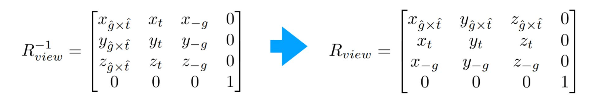

由此，我们就得到了我们所需要的视图变换：Mview 

我们不仅要对这个相机进行此变换，**还要对所有的物体进行这个变换**。

## 投影变换
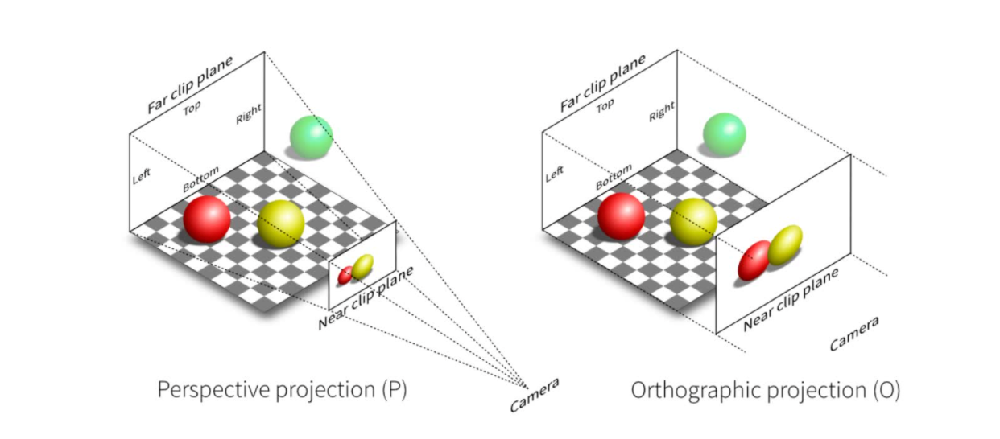

- 正交投影：没有近大远小的视觉特点，就好像相机离物体无穷远，远平面和近平面的大小一样大。
- 透视投影：摄像机放在某一个位置上，连成一个空间中的锥，我们希望把四棱锥里面的东西都映射在近平面上。

### 正交投影

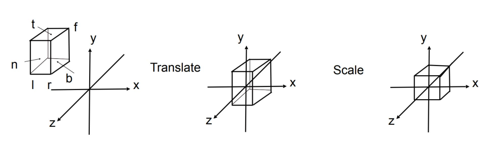
在摄像机坐标系中选取一个立方体范围，设在 x, y, z 方向上的范围分别是$[l,r]; [b,t]; [f,n]$,然后平移并缩放至$[-1,1]^3$。

> 之所以 $f < n$ (far < near)，即在 z 轴上远坐标小于近坐标，是因为我们的 gaze-at 方向是顺着 -z 轴方向，所以越远的点z值越小。
>这样选取 gaze-at 的方向是为了配合 model，因为 model 是以所有轴正方向作为正向的，以 -z 为 gaze-at 方向可以模拟人类正常的观察方向。如果反向朝向z方向，投影之后物体就是关于原点对称的（x轴）。

这也是为什么有些API（比如OpenGL）使用左手系，可以让z值都方便为正值。

具体操作：
* 将物体平移到原点
* 将物体缩放至标准立方体$[-1,1]^3$中

这个变换矩阵是：
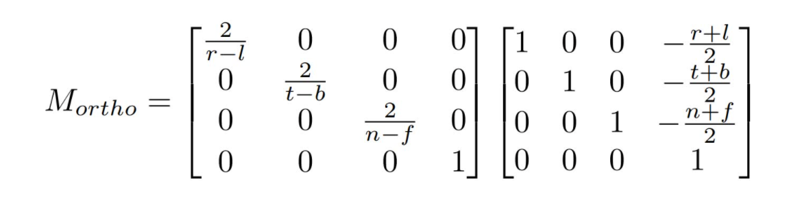

### 透视投影
下图是我们透视投影中的四棱锥,n是近平面，f是远平面
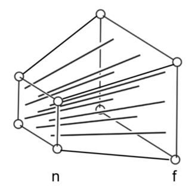

我们可以将透视投影的分解成2个操作：
1. 先把视椎体（上左）压缩成标准立方体（上右），也就是**远近平面一样大**$(M_persp->ortho)$
2. 进行正交投影$(M_ortho)$

我们如何进行缩放操作，我们先要进行一些观察和规定。
1. **近平面上的z值是不会发生变化的**
2. **远平面的z值f在向中间挤的过程也不会发生变化**
3. **远平面的中心点是不受挤压的影响的，变换后仍然是中心点**

注意：我们的变换是针对四棱锥空间内所有的点，不光是远平面和近平面。

我们用下面的图来解释投影的过程，将$(x,y,z)$一点投影到屏幕之后，它的坐标变为了$(x'，y'，z')$

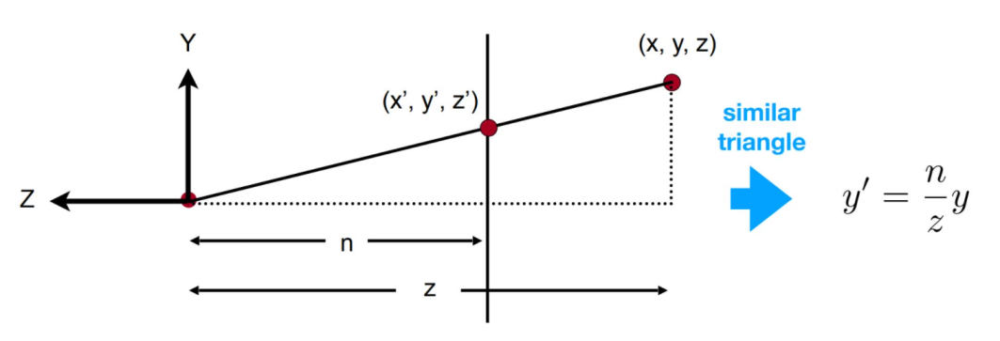           
根据相似三角形可得(空间中任意点的z的值变为近平面的z值n)：
$$
y' = \frac{n}{z} * y
$$

$$
x' = \frac{n}{z} * x
$$

问题转换成，我们要寻找一个变化矩阵$(M_persp->ortho)$，这个矩阵作用于$(x,y,z,1)$(点)后得到 $(\frac{n}{z} * y,  \frac{n}{z} * x, ?, 1)$，即$(nx,ny,?,z)$

易得：
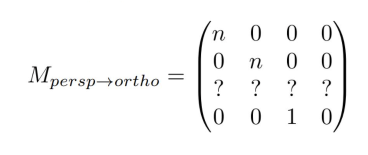

这里的z值也会发生变换，但我们还没有规定好这个z值具体该怎么变换。但我们知道，近平面上的点经过这个矩阵的作用，还是在这个平面上没有变化。
也就是$(x,y,n,1)$变换后得到$(nx,ny,n^2,n)$
>这个坐标格式是怎么来的呢，因为我们的定义中， $(x,y,z,1)$ 变换得到$(nx,ny,?,z)$,所以$(x,y,n,1)$要变换得到$(nx,ny,n^2,n)$
>

显然这和x,y的取值没有关系，所以前两个值显然为0,设第三第四分别为A、B.
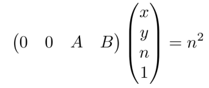

光这个等式还不够，我们还规定，远平面的中心点$(0,0,f,1)$变换后不变
所以$(M_persp->ortho)$作用于$(0,0,f,1)$得到$(0,0,f^2,f)$

综合上面两个式子得到

$$
A = n + f
$$

$$
B = -n*f
$$

得到
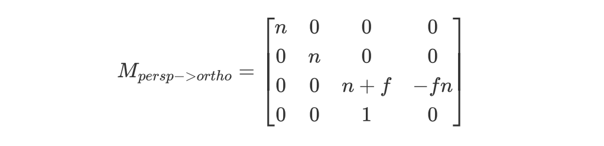

最后的一步，将这个被压缩过的空间，重新正交投影成"标准立方体"，故定义透视投影变换$M_persp$如下：
$$
M_persp = M_ortho * M_persp->ortho
$$
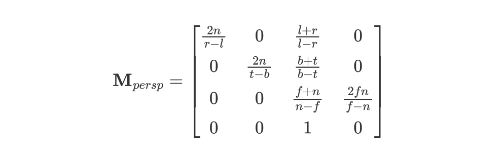

大部分的内容都讲完了，还有最后一个小问题，如何定义近平面的 t,b,l,r (上下左右的位置)呢？

一般常用：宽高比 (aspect ratio)、垂直可视角度 (fovY) 来描述
* 垂直可视角度：上端中点，视点，下端中点之间的夹角
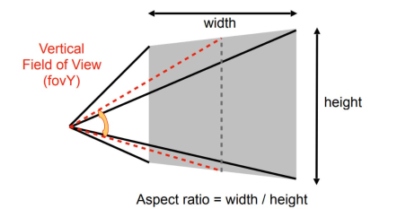
可得：
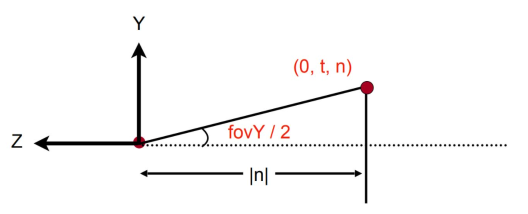

### 课堂问题

我们知道，透视投影后，近平面和远平面的z值都会保持不变，那么远近平面之间的点的z会发生什么变化呢？

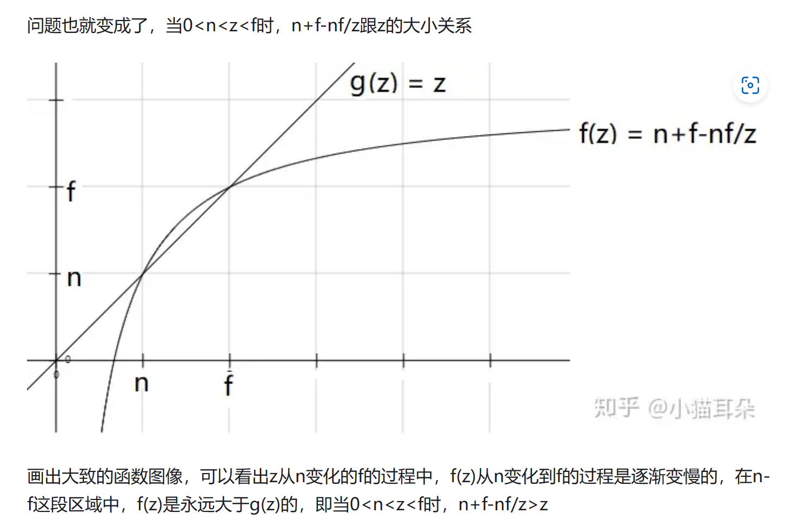
画出大致的函数图像，可以看出z从n变化的f的过程中，f(z)从n变化到f的过程是逐渐变慢的，在n-f这段区域中，f(z)是永远大于g(z)的，即当0<n<z<f时，n+f-nf/z>z

也就是说，视锥体内的点被挤压的更偏向了远平面f。

